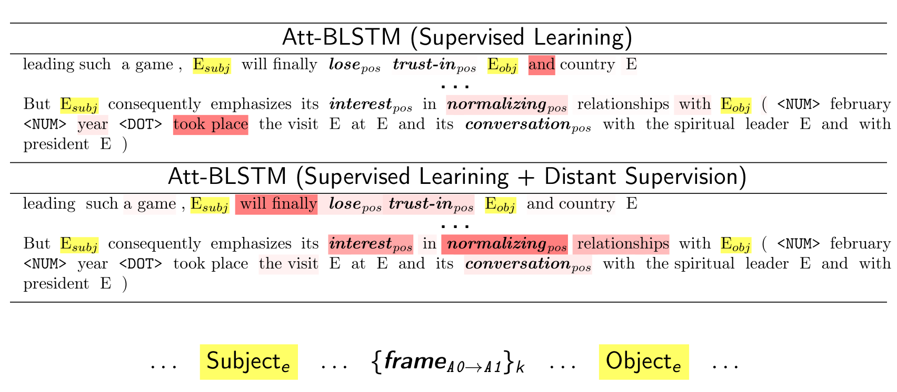

# Attention-Based Neural Networks for Sentiment Attitude Extraction using Distant Supervision


> **Image**: Application of Distant Supervision (DS) 
results in biased weight distribution of models, trained without DS: frames in between **Object** and 
**Subject** of context attitude become more significant, which corresponds to the pattern of contents [RuAttitudes](https://github.com/nicolay-r/RuAttitudes) collection.

This repository provides a source code of models and related experiments, conducted as a part of the following paper:

* Attention-Based Neural Networks for Sentiment Attitude Extraction using Distant Supervision [[ACM-DOI]](https://doi.org/10.1145/3405962.3405985)
    * Rusnachenko Nicolay, Loukachevitch Natalia
    * WIMS-2020

## Dependencies

* Python-2.7
* arekit-0.20.0

## Installation

* **Core library installation:** All the implementation depends on
core library for *sentiment attitude extraction*,
dubbed as [**arekit-0.20.3**](https://github.com/nicolay-r/AREkit/blob/0.20.3-wims-rc/README.md):
> **NOTE:** it is important to download in ``arekit`` directory.
```
# Download arekit-0.20.3
git clone --single-branch --branch 0.20.3-wims-rc https://github.com/nicolay-r/AREkit arekit

# Install dependencies
pip install -r arekit/dependencies.txt
```
* **Resources**: Since **arekit-0.20.0** all the resources such as collections
(RuAttitudes, RuSentRel) and lexicons
(RuSentiLex) are a part of the related library.

* **Word2Vec**: installation assumes to run a ``download.sh`` script:
```
cd data && ./download.sh
```

## References

```
@inproceedings{rusnachenko-2020-attention-ds,
    title = "Attention-Based Neural Networks for Sentiment Attitude Extraction using Distant Supervision",
    author = "Rusnachenko, Nicolay  and Loukachevitch, Natalia",
    booktitle = "The 10th International Conference on Web Intelligence, Mining and Semantics (WIMS 2020), 
      June 30-July 3, 2020, Biarritz, France",
    year = "2020",
    url = "https://doi.org/10.1145/3405962.3405985",
    doi = "10.1145/3405962.3405985",
}
```
