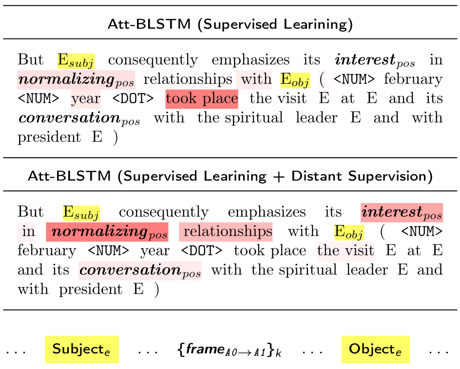

# Attention-Based Neural Networks for Sentiment Attitude Extraction using Distant Supervision

> **UPD 17'th december 2020**: distance between terms parameter (`thetta`, which equals 10) may discard some pairs from further consideration which affects on results. [[issue]](https://github.com/nicolay-r/attitude-extraction-with-attention-and-ds/issues/1)


> **Figure**: Application of Distant Supervision in model 
training process results in a weight distribution biasing: 
frames in between subject and object of attitude got more 
weight values; the latter reflects the pattern of 
frame-based approach, utilized in [RuAttitudes](https://github.com/nicolay-r/RuAttitudes) collection development.

This repository provides a source code of models and related experiments, conducted as a part of the following paper:

* Attention-Based Neural Networks for Sentiment Attitude Extraction using Distant Supervision 
[[ACM-DOI]](https://doi.org/10.1145/3405962.3405985) /
[[presentation]](docs/wims_2020_slides.pdf)
    * Rusnachenko Nicolay, Loukachevitch Natalia
    * WIMS-2020

## Dependencies

* Python-2.7
* arekit-0.20.3 [[**WIMS-2020 edition**]](https://github.com/nicolay-r/AREkit/blob/0.20.3-wims-rc/README.md)

## Installation

* **Core library installation:** All the implementation depends on
core library for *sentiment attitude extraction*,
dubbed as [**arekit-0.20.3**](https://github.com/nicolay-r/AREkit/blob/0.20.3-wims-rc/README.md):
> **NOTE:** it is important to download in ``arekit`` directory.
```
# Download arekit-0.20.3
git clone --single-branch --branch 0.20.3-wims-rc https://github.com/nicolay-r/AREkit arekit

# Install dependencies
pip install -r arekit/dependencies.txt
```
* **Resources**: Since **arekit-0.20.0** all the resources such as collections
(RuAttitudes, RuSentRel) and lexicons
(RuSentiLex) are a part of the related library.

* **Word2Vec**: installation assumes to run a ``download.sh`` script:
```
cd data && ./download.sh
```

## Usage

1. Select the appropriate Exteperiment format (TwoScale or ThreeScale) by uncommenting one of the line [at io_utils.py](https://github.com/nicolay-r/attitude-extraction-with-attention-and-ds/blob/c463a13fc663ab2d53c0f2af74d432b171657994/io_utils.py#L28):
```python
# You may manually select three-scale mode by commenting one of these two lines below. 
# self.__neutral_annotator = self.__init_two_scale_neutral_annotator() # <- 2-scale
# self.__neutral_annotator = self.__init_three_scale_neutral_annotator() # <- 3-scale
```

2. Proceed with the `run_*.sh` scripts in the following directories:
   * [Supervised Learning, Fixed Train/Test separation](https://github.com/nicolay-r/attitude-extraction-with-attention-and-ds/tree/master/rusentrel/classic)
   * [Supervised Learning, CV-based separation](https://github.com/nicolay-r/attitude-extraction-with-attention-and-ds/tree/master/rusentrel/classic_cv)
   * [SL+DS, Fixed Train/Test separation](https://github.com/nicolay-r/attitude-extraction-with-attention-and-ds/tree/master/rusentrel/rusentrel_ds)
   * [SL+DS, CV-based separation](https://github.com/nicolay-r/attitude-extraction-with-attention-and-ds/tree/master/rusentrel/rusentrel_ds_cv)

## References

```
@inproceedings{rusnachenko-2020-attention-ds,
    title = "Attention-Based Neural Networks for Sentiment Attitude Extraction using Distant Supervision",
    author = "Rusnachenko, Nicolay  and Loukachevitch, Natalia",
    booktitle = "The 10th International Conference on Web Intelligence, Mining and Semantics (WIMS 2020), 
      June 30-July 3, 2020, Biarritz, France",
    year = "2020",
    url = "https://doi.org/10.1145/3405962.3405985",
    doi = "10.1145/3405962.3405985",
}
```
